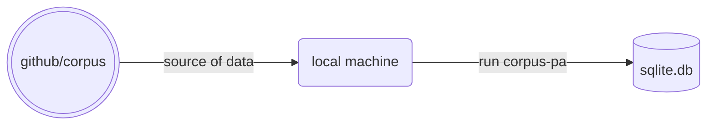

# corpus-pax

Setting up the initial, foundational tables with generic users and organizations.



Implies the existence of an _updated_ Github `corpus` repository. Data concerning members will be pulled from such repository. Each avatar image should be named `avatar.jpeg` so that these can be uploaded to Cloudflare.

## Install

```zsh
poetry add corpus-pax
poetry update
```

## Supply .env

Create an .env file to create/populate the database. See [sample .env](.env.example) highlighting the following variables:

1. Cloudflare `CF_ACCT`
2. Cloudflare `CF_TOKEN`
3. Github `EXPIRING_TOKEN`
4. `DB_FILE` (sqlite)

Note the [workflow](.github/workflows/main.yml) where the secrets are included for Github actions. Ensure these are set in the repository's `<url-to-repo>/settings/secrets/actions`, making the proper replacements when the tokens for Cloudflare and Github expire.

### Notes

#### Why Github

The names and profiles of individuals and organizations are stored in Github. These are pulled into the application via an API call requiring the use of a personal access token.

#### Why Cloudflare Images

Individuals and organizations have images stored in Github. To persist and optimize images for the web, I use Cloudflare images.

#### Why sqlite

The initial data is simple. This database however will be the foundation for a more complicated schema. Sqlite seems a better fit for experimentation and future embeddability of the same for app use.

## Steps

### Review database connection

Use the database path declared in DB_FILE to establish an sqlite3 connection:

```python
from sqlpyd import Connection  # this is sqlite-utils' Database() under the hood

c = Connection()  # type: ignore

# the filename will later be created in the root directory of the project folder
Connection(DatabasePath="ex.db", WALMode=False)
```

This connection will be used to access the database.

## Add persons

Create and populate the _persons_-related tables:

```python
from corpus_pax import init_persons

# This is a shortcut to: init_person_tables(c); add_individuals_from_api(c); and add_organization_from_api(c)
init_persons(c)
```
