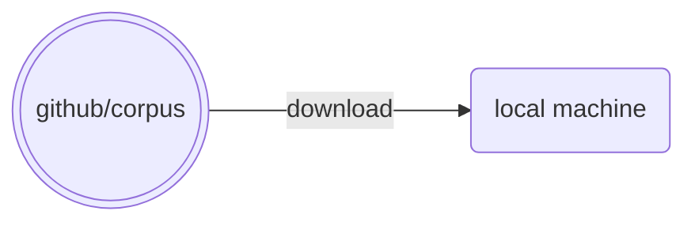
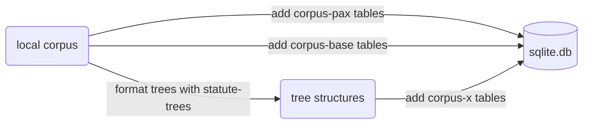
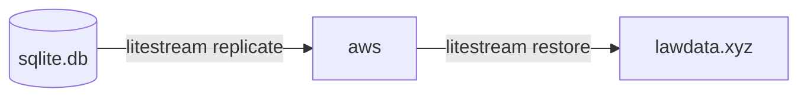

# corpus-x

## Concept

[corpus-pax](https://github.com/justmars/corpus-pax) + [corpus-base](https://github.com/justmars/corpus-base) + [statute-trees](https://github.com/justmars/statute-trees) = converts raw `yaml`-based corpus repository to its database variant **corpus-x**; see [details](notebooks/setup.ipynb). After constructing all of the required tables, it becomes possible to [evaluate the raw data](docs/5-db-evaluate.md).

## Flow

### Local files

Download *.yaml files from repository:



### Local database

Setup local db:



### Replicated database

Store backup db on aws:



## Mode

Order | Time | Instruction | Docs
:--:|:--:|--:|:--
0 | ~6sec (if with test data) | [corpus-pax](https://github.com/justmars/corpus-pax#read-me) pre-requiste before `corpus-base` can work. |[Setup](docs/1-setup.md)
1 | ~20-40min | [corpus-base](https://github.com/justmars/corpus-base#read-me) pre-requiste before `corpus-x` can work. |[Setup](docs/1-setup.md)
2 | ~120-130min | If inclusion files not yet created, run script to generate. |[Pre-inclusions](docs/2-pre-inclusions.md)
3 | ~10min | Assuming inclusion files are already created, can populate the various tables under `corpus-x` | [Post-inclusions](docs/3-post-inclusions.md)
4 | ~60min | Litestream output `x.db` on AWS bucket | [Replicated db](docs/4-aws-replicate.md)

## Gotchas

The statutory event data contained in the `units` field does not yet contain the `statute_id`s. Note that, prior to database insertion, we only know the statute label but not the id. Once the statute has been inserted, we can now match the statute label to the id:

```python
for row in c.db[CodeRow.__tablename__].rows:
    obj = CodeRow.set_update_units(c, row["id"])
```
